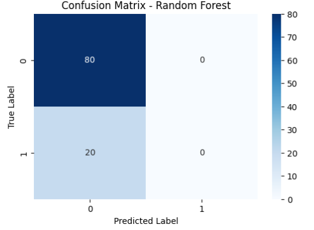
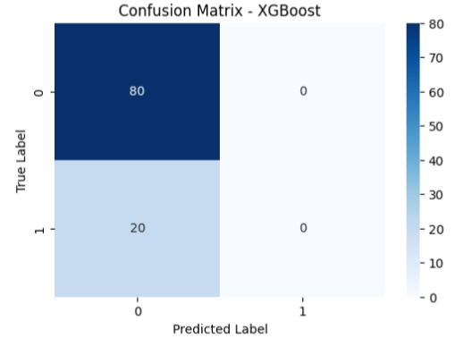
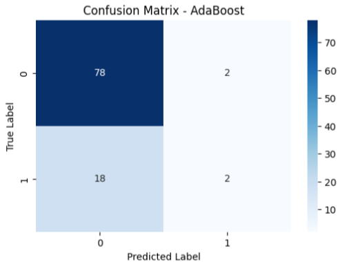

# Sistem Prediksi Mahasiswa Berisiko Tinggi Drop Out - Kelompok 5
## Anggota Kelompok 5:

1. Attiya Dianti Fadli (G1A022002)  
2. Tiesya Andriani Ramadhanti (G1A022014)  
3. Imelda Cyntia (G1A022022)  

# Project Overview
## Latar Belakang

Dalam era digital saat ini, tantangan dalam dunia pendidikan tinggi semakin kompleks, salah satunya adalah meningkatnya angka mahasiswa yang tidak menyelesaikan studi atau mengalami putus kuliah (*drop out*). Permasalahan ini dapat berdampak buruk, baik bagi mahasiswa itu sendiri maupun bagi institusi pendidikan. Mahasiswa yang *drop out* kehilangan waktu, biaya, dan kesempatan, sedangkan institusi mengalami penurunan angka retensi dan citra akademik.

Seiring dengan berkembangnya teknologi informasi, institusi pendidikan kini memiliki akses terhadap berbagai data akademik mahasiswa, seperti data nilai, jumlah SKS, kehadiran, hingga status sosial ekonomi. Data tersebut memiliki potensi besar untuk dianalisis menggunakan teknik *data mining* guna mengidentifikasi pola dan karakteristik mahasiswa yang berisiko tinggi mengalami *drop out*.

Salah satu pendekatan yang umum digunakan dalam analisis ini adalah *klasifikasi*—yakni membangun model prediktif yang mampu mengelompokkan mahasiswa ke dalam kategori "berisiko" dan "tidak berisiko". Menurut Yaacob et al. (2020), penerapan algoritma seperti Decision Tree, Naive Bayes, dan Neural Network menunjukkan tingkat akurasi yang tinggi dalam memprediksi potensi *drop out* mahasiswa. Selain itu, penelitian Alfiana dan Rahmadani (2023) juga menyimpulkan bahwa teknik *data mining* mampu membantu pihak kampus dalam mendeteksi dini mahasiswa yang membutuhkan intervensi akademik. 

Lebih lanjut, Mduma et al. (2019) menekankan pentingnya penerapan sistem prediksi *drop out* di negara berkembang, di mana tantangan seperti keterbatasan data dan ketidakseimbangan jumlah kelas sering terjadi. Mereka menyarankan agar institusi pendidikan mengembangkan model prediksi berbasis data internal dan memanfaatkan teknik evaluasi yang sesuai seperti *F1-Score* dan *AUC* agar hasil yang diperoleh lebih akurat dan bermanfaat untuk pengambilan keputusan.

Pada proyek ini, dibangun sebuah sistem prediksi mahasiswa berisiko tinggi *drop out* menggunakan teknik *data mining* berbasis algoritma klasifikasi. Sistem ini menggunakan data akademik dan demografis mahasiswa untuk mengidentifikasi potensi risiko sejak dini.

### Tujuan dari proyek ini adalah untuk:
- Menganalisis faktor-faktor yang mempengaruhi risiko *drop out* pada mahasiswa.
- Mengembangkan model klasifikasi untuk memprediksi mahasiswa berisiko tinggi *drop out*.
- Memberikan hasil prediksi yang dapat digunakan oleh pihak kampus sebagai dasar untuk melakukan intervensi preventif.

Dengan adanya sistem ini, diharapkan institusi pendidikan dapat meningkatkan angka kelulusan dan memberikan dukungan akademik yang lebih tepat sasaran kepada mahasiswa yang membutuhkan.

### Daftar Referensi
- Yaacob, M., Al‑Mudhafar, W. J., & Abdullah, S. (2020). *Student Dropout Prediction Model Based on Machine Learning Algorithms*. Journal of Physics: Conference Series, 1496(1), 012005. https://doi.org/10.1088/1742‑6596/1496/1/012005  
- Alfiana, A. S., & Rahmadani, L. (2023). *Prediksi Mahasiswa Drop Out Menggunakan Algoritma Decision Tree C4.5*. Jurnal Informatika Upgris (JIU), 9(1), 40–48. https://journal.upgris.ac.id/index.php/JIU/article/view/8023  
- Mduma, N., Kalegele, K., & Machuve, D. (2019). *A Survey of Machine Learning Approaches and Techniques for Student Dropout Prediction*. Data Science Journal, 18:14. https://doi.org/10.5334/dsj-2019-014

## Business Understanding

### Problem Statement
Angka putus kuliah (*drop out*) mahasiswa di perguruan tinggi merupakan permasalahan serius yang dapat berdampak negatif pada mahasiswa, institusi pendidikan, dan masyarakat. Banyak faktor yang menyebabkan mahasiswa mengalami drop out, seperti prestasi akademik yang menurun, masalah ekonomi, atau kurangnya dukungan lingkungan belajar. Namun, institusi pendidikan sering kali kesulitan untuk mengidentifikasi mahasiswa yang berisiko sebelum terlambat.

Tanpa adanya sistem deteksi dini, pihak kampus akan kehilangan peluang untuk memberikan intervensi atau bantuan yang tepat waktu kepada mahasiswa yang membutuhkan.

### Goals
Tujuan dari proyek ini adalah untuk membangun sebuah sistem prediksi berbasis data yang dapat:
- Mengidentifikasi mahasiswa yang berisiko tinggi mengalami drop out.
- Menganalisis faktor-faktor utama yang berkontribusi terhadap potensi drop out.
- Memberikan hasil prediksi yang dapat dimanfaatkan oleh pihak akademik sebagai bahan pertimbangan untuk intervensi dini atau program pendampingan.

### Solution Approach

Proyek ini menggunakan pendekatan metode data mining berbasis **CRISP-DM (Cross-Industry Standard Process for Data Mining)** yang terdiri dari beberapa tahapan sistematis sebagai berikut:

1. **Business Understanding**  
   Memahami permasalahan bisnis yaitu mengidentifikasi mahasiswa yang berisiko tinggi mengalami drop out sehingga institusi dapat mengambil tindakan preventif yang tepat.

2. **Data Understanding**  
   Mengumpulkan dan memahami dataset yang berisi informasi akademik, demografis, dan sosial mahasiswa seperti IPK, jumlah SKS, status beasiswa, kehadiran, dan atribut lain yang relevan. Tahap ini juga meliputi eksplorasi data awal untuk memahami distribusi dan pola data.

3. **Data Preparation**  
   Melakukan pembersihan data, penanganan data hilang (missing values), normalisasi, encoding variabel kategorikal, dan transformasi data agar siap digunakan dalam pemodelan.

4. **Modeling**  
   Pada tahap modeling, dilakukan pembangunan model prediksi untuk mengidentifikasi mahasiswa yang berisiko mengalami drop out menggunakan beberapa algoritma klasifikasi dengan pendekatan dan keunggulan berbeda. Enam model yang dipilih adalah sebagai berikut:

* Random Forest: Metode ensemble berbasis pohon keputusan yang efektif untuk data berdimensi tinggi dan mampu mengatasi missing value.
* XGBoost (Extreme Gradient Boosting): Teknik boosting yang memperbaiki kelemahan model iterasi sebelumnya dengan hasil akurasi tinggi dan kemampuan pengendalian overfitting.
* K-Nearest Neighbors (KNN): Algoritma berbasis instance yang memprediksi kelas berdasarkan kedekatan data tetangga terdekat dalam ruang fitur.
* Decision Tree: Model pohon keputusan yang sederhana dan mudah diinterpretasikan, tetapi rentan terhadap overfitting.
* Gradient Boosting: Teknik boosting yang menggabungkan beberapa model pohon keputusan lemah untuk menghasilkan model kuat dengan akurasi tinggi.
* AdaBoost (Adaptive Boosting): Teknik boosting yang memfokuskan pembelajaran pada data yang sulit diklasifikasikan sebelumnya, berguna untuk menangani data minoritas.

Setiap model diinisialisasi dengan parameter dasar dan menggunakan `random_state` untuk memastikan hasil yang reproducible.

5. **Evaluation**  
   Mengevaluasi performa model menggunakan metrik seperti Accuracy, Precision, Recall, F1-Score, dan Confusion Matrix untuk memastikan model dapat mengidentifikasi mahasiswa berisiko secara akurat.

# Data Understanding

Dataset yang digunakan dalam proyek ini merupakan dataset dummy yang dibuat secara khusus untuk mendukung pengembangan sistem prediksi mahasiswa berisiko tinggi drop out. Dataset ini berisi informasi akademik, kehadiran, aktivitas belajar, serta kondisi sosial ekonomi mahasiswa.

## Informasi Umum Dataset

- Jumlah data: 500 baris (record mahasiswa)
- Jumlah kolom: 28 kolom
- Tidak terdapat missing value pada seluruh kolom

## Struktur Dataset dan Penjelasan Kolom

| No  | Nama Kolom                  | Tipe Data | Keterangan                                                                                          |
|------|-----------------------------|-----------|---------------------------------------------------------------------------------------------------|
| 0    | nim                         | object    | Nomor Induk Mahasiswa, identifier unik setiap mahasiswa                                          |
| 1    | ipk_semester_1              | float64   | Indeks Prestasi Kumulatif semester 1                                                             |
| 2    | ipk_semester_2              | float64   | Indeks Prestasi Kumulatif semester 2                                                             |
| 3    | ipk_semester_3              | float64   | Indeks Prestasi Kumulatif semester 3                                                             |
| 4    | ipk_semester_4              | float64   | Indeks Prestasi Kumulatif semester 4                                                             |
| 5    | ipk_semester_5              | float64   | Indeks Prestasi Kumulatif semester 5                                                             |
| 6    | ipk_semester_6              | float64   | Indeks Prestasi Kumulatif semester 6                                                             |
| 7    | ipk_semester_7              | float64   | Indeks Prestasi Kumulatif semester 7                                                             |
| 8    | ipk_semester_8              | float64   | Indeks Prestasi Kumulatif semester 8                                                             |
| 9    | kehadiran_basis_data        | float64   | Persentase kehadiran pada mata kuliah Basis Data                                                  |
| 10   | kehadiran_pemrograman_web   | float64   | Persentase kehadiran pada mata kuliah Pemrograman Web                                             |
| 11   | kehadiran_kalkulus          | float64   | Persentase kehadiran pada mata kuliah Kalkulus                                                    |
| 12   | kehadiran_matematika_diskrit| float64   | Persentase kehadiran pada mata kuliah Matematika Diskrit                                         |
| 13   | kehadiran_machine_learning  | float64   | Persentase kehadiran pada mata kuliah Machine Learning                                           |
| 14   | basis_data_ulang            | int64     | Jumlah pengulangan mata kuliah Basis Data                                                        |
| 15   | pemrograman_web_ulang       | int64     | Jumlah pengulangan mata kuliah Pemrograman Web                                                   |
| 16   | kalkulus_ulang              | int64     | Jumlah pengulangan mata kuliah Kalkulus                                                          |
| 17   | matematika_diskrit_ulang    | int64     | Jumlah pengulangan mata kuliah Matematika Diskrit                                                |
| 18   | machine_learning_ulang      | int64     | Jumlah pengulangan mata kuliah Machine Learning                                                  |
| 19   | frekuensi_login_lms         | int64     | Frekuensi login mahasiswa ke Learning Management System                                          |
| 20   | waktu_akses_materi          | float64   | Rata-rata waktu akses materi pembelajaran dalam jam                                              |
| 21   | partisipasi_forum           | int64     | Jumlah partisipasi mahasiswa dalam forum diskusi online                                          |
| 22   | status_pekerjaan            | object    | Status pekerjaan mahasiswa (misal: Bekerja, Tidak Bekerja)                                       |
| 23   | jam_kerja_per_minggu        | int64     | Jumlah jam kerja mahasiswa per minggu jika bekerja                                               |
| 24   | penghasilan_orang_tua       | int64     | Penghasilan orang tua mahasiswa dalam satuan rupiah                                             |
| 25   | jumlah_tanggungan_keluarga  | int64     | Jumlah tanggungan keluarga mahasiswa                                                             |
| 26   | beasiswa                    | object    | Status penerima beasiswa (Ya/Tidak)                                                              |
| 27   | status_do                   | int64     | Target variabel: status drop out mahasiswa (1 = berisiko drop out, 0 = tidak)                     |

## Contoh Data

| nim       | ipk_semester_1 | ipk_semester_2 | ipk_semester_3 | ipk_semester_4 | ipk_semester_5 | ipk_semester_6 | ipk_semester_7 | ipk_semester_8 | kehadiran_basis_data | kehadiran_pemrograman_web | kehadiran_kalkulus | kehadiran_matematika_diskrit | kehadiran_machine_learning | basis_data_ulang | pemrograman_web_ulang | kalkulus_ulang | matematika_diskrit_ulang | machine_learning_ulang | frekuensi_login_lms | waktu_akses_materi | partisipasi_forum | status_pekerjaan | jam_kerja_per_minggu | penghasilan_orang_tua | jumlah_tanggungan_keluarga | beasiswa | status_do |
|-----------|----------------|----------------|----------------|----------------|----------------|----------------|----------------|----------------|----------------------|---------------------------|--------------------|-----------------------------|----------------------------|------------------|-----------------------|----------------|--------------------------|-----------------------|---------------------|--------------------|-------------------|-----------------|-----------------------|-----------------------|----------------------------|----------|-----------|
| G1A018001 | 2.75           | 3.4            | 2.37           | 3.04           | 2.52           | 3.66           | 3.35           | 2.57           | 82.9                 | 84                        | 75.7               | 80.7                        | 85.9                       | 1                | 1                     | 1              | 0                        | 2                     | 28                  | 6.9                | 22                | paruh_waktu     | 45                    | 19585069              | 6                          | ya       | 0         |
| G1A018002 | 3.9            | 3.07           | 3.08           | 2.96           | 2.49           | 3.53           | 3.59           | 3.61           | 92.2                 | 80.5                      | 78.9               | 62                          | 66.9                       | 2                | 1                     | 2              | 2                        | 0                     | 21                  | 19.9               | 7                 | full_time       | 4                     | 16158830              | 6                          | ya       | 0         |
| G1A018003 | 3.46           | 2.62           | 3.75           | 2.05           | 3.81           | 3.15           | 2.5            | 3.99           | 90.4                 | 71.5                      | 94.2               | 69.3                        | 94.9                       | 0                | 1                     | 2              | 0                        | 2                     | 26                  | 15.4               | 23                | tidak_bekerja   | 57                    | 10311487              | 3                          | tidak    | 0         |
| G1A018004 | 3.2            | 3.63           | 3.46           | 2.68           | 2.5            | 3.91           | 3.25           | 2.06           | 66.2                 | 60.3                      | 73.6               | 79.7                        | 84.5                       | 2                | 1                     | 1              | 2                        | 1                     | 9                   | 15.2               | 13                | paruh_waktu     | 59                    | 15244799              | 2                          | tidak    | 0         |
| G1A018005 | 2.31           | 3.37           | 3.61           | 2.76           | 2.54           | 2.4            | 3.14           | 3.79           | 66                   | 79.8                      | 94.8               | 72.4                        | 66.3                       | 1                | 1                     | 2              | 2                        | 0                     | 15                  | 19.1               | 5                 | tidak_bekerja   | 23                    | 15262957              | 3                          | tidak    | 1         |


## Keterangan Tambahan

- Kolom `nim` digunakan sebagai identifier unik mahasiswa.
- Kolom IPK tiap semester digunakan untuk melacak performa akademik selama masa studi.
- Data kehadiran dan pengulangan mata kuliah memberikan gambaran tentang keterlibatan mahasiswa dalam perkuliahan.
- Aktivitas di LMS dan forum menunjukkan tingkat partisipasi dan penggunaan sumber belajar online.
- Variabel sosial ekonomi seperti status pekerjaan, jam kerja, penghasilan orang tua, dan beasiswa juga dimasukkan untuk memperkaya analisis risiko drop out.
- Kolom `status_do` menjadi variabel target untuk model klasifikasi dalam memprediksi risiko drop out mahasiswa.

# Univariate Data Analysis
## Memisahkan Kolom Kategorikal dan Numerik

Langkah awal dalam eksplorasi data adalah memisahkan fitur berdasarkan tipe datanya:

- **Kolom Numerik**: Berisi angka yang bisa dihitung secara statistik.
  Contoh: `ipk_semester_1`, `frekuensi_login_lms`, `penghasilan_orang_tua`, dll.
- **Kolom Kategorikal**: Berisi kategori atau label diskrit (biasanya dalam bentuk teks atau nilai diskrit).
  Contoh: `status_pekerjaan`, `beasiswa`, `status_do`.

Pemilahan ini berguna untuk:
- Melakukan analisis statistik sesuai tipe data.
- Menentukan proses preprocessing seperti encoding untuk kategorikal data.

## Analisis Variabel Kategorikal

Analisis dilakukan terhadap kolom-kolom seperti:
- `status_pekerjaan`: `full_time`, `paruh_waktu`, `tidak_bekerja`
- `beasiswa`: `ya`, `tidak`
- `status_do`: `0` (tidak DO), `1` (DO)

Hal yang dianalisis:
- **Distribusi kategori**: seberapa banyak data pada masing-masing kategori.
- **Visualisasi**: bar chart atau pie chart untuk mempermudah interpretasi.
- **Kaitan dengan variabel target**: apakah suatu kategori berpengaruh terhadap DO?

Tujuannya adalah untuk mengetahui pola yang tersembunyi dalam kelompok-kelompok data ini.

## Analisis Variabel Numerikal

Variabel numerik seperti:
- IPK per semester: `ipk_semester_1` s.d. `ipk_semester_8`
- Kehadiran per mata kuliah
- `frekuensi_login_lms`, `waktu_akses_materi`, `penghasilan_orang_tua`, dll.

Analisis yang dilakukan:
- **Statistik deskriptif**: nilai rata-rata, median, minimum, maksimum, standar deviasi.
- **Visualisasi**: histogram, boxplot, density plot untuk melihat distribusi dan outlier.
- **Korelasi**: mencari hubungan antar variabel, atau antara variabel dengan `status_do`.

Tujuannya adalah untuk memahami distribusi nilai dan pola hubungan antar fitur numerik.

## Analisis Variabel Target

Variabel target dalam dataset ini adalah: `status_do`
- Nilai `0` → Mahasiswa **tidak DO**
- Nilai `1` → Mahasiswa **drop out (DO)**

Analisis yang dilakukan:
- **Distribusi kelas**: apakah data seimbang antara yang DO dan tidak DO?
- **Hubungan dengan fitur lain**:
  - Apakah IPK rendah cenderung menyebabkan DO?
  - Bagaimana pengaruh kehadiran dan interaksi di LMS terhadap DO?
  - Apakah mahasiswa yang bekerja memiliki risiko lebih tinggi untuk DO?

Tujuan akhir dari analisis ini adalah:
- Mengetahui pola-pola yang mengarah ke DO.
- Menyusun fitur penting yang digunakan dalam pembuatan model prediksi DO.

# Data Preprocessing

Pada tahap ini, dilakukan serangkaian proses prapemrosesan data untuk mempersiapkan dataset agar dapat digunakan dalam pemodelan machine learning. Tahapan preprocessing terdiri dari tiga langkah utama, yaitu normalisasi, encoding, dan feature selection. Berikut penjelasan masing-masing tahapannya:

## 1. Normalisasi

Langkah pertama dalam preprocessing adalah normalisasi data numerik. Normalisasi dilakukan untuk menyeragamkan skala nilai pada seluruh kolom numerik agar berada dalam rentang 0 hingga 1. Proses ini penting karena beberapa algoritma machine learning, seperti Support Vector Machine (SVM) atau K-Nearest Neighbors (KNN), sangat sensitif terhadap perbedaan skala antar fitur.

Normalisasi dilakukan menggunakan teknik Min-Max Scaling, yang mengubah nilai minimum menjadi 0 dan nilai maksimum menjadi 1. Contohnya, kolom seperti `ipk_semester_1` yang sebelumnya memiliki rentang nilai 2.80–3.90, setelah normalisasi menjadi 0.15–0.95. Tahapan ini hanya diterapkan pada fitur numerik, sementara fitur kategorikal belum mengalami perubahan pada tahap ini.

## 2. Encoding

Setelah proses normalisasi, tahap berikutnya adalah mengubah data kategorikal menjadi data numerik agar dapat diproses oleh model machine learning.

* Kolom `status_pekerjaan` yang bersifat kategorikal diubah menjadi bentuk numerik menggunakan teknik One-Hot Encoding. Hasilnya adalah muncul beberapa kolom baru yang merepresentasikan setiap kategori pekerjaan (misalnya, `pekerjaan_full_time`, `pekerjaan_paruh_waktu`, dan `pekerjaan_tidak_bekerja`). Setiap baris hanya memiliki satu nilai "1" pada salah satu kolom tersebut sesuai status pekerjaan mahasiswa.

* Kolom `beasiswa` diubah menggunakan teknik Label Encoding, di mana nilai "ya" dikonversi menjadi 1 dan "tidak" menjadi 0.

Dengan proses encoding ini, seluruh fitur dalam dataset telah dikonversi menjadi bentuk numerik dan siap digunakan dalam pelatihan model.

## 3. Feature Selection

Tahap terakhir dari preprocessing adalah feature selection untuk menentukan fitur-fitur mana yang paling relevan dalam memprediksi status DO mahasiswa. Teknik yang digunakan adalah SelectKBest dengan metode f\_classif (ANOVA F-test), yang mengevaluasi tingkat pengaruh masing-masing fitur terhadap variabel target (`status_do`).

Seluruh fitur dievaluasi dan diberikan skor berdasarkan pengaruhnya. Kemudian ditentukan threshold skor minimal sebesar 1.0. Fitur-fitur yang memiliki skor di atas atau sama dengan threshold dianggap signifikan dan dipilih untuk proses selanjutnya.

Fitur yang terpilih berdasarkan hasil seleksi adalah:

* `penghasilan_orang_tua`
* `ipk_semester_1`
* `ipk_semester_6`
* `ipk_semester_8`
* `kalkulus_ulang`
* `pemrograman_web_ulang`
* `jumlah_tanggungan_keluarga`

Fitur-fitur ini mencerminkan bahwa baik faktor akademik (seperti IPK dan pengulangan mata kuliah) maupun faktor sosial-ekonomi (seperti penghasilan dan tanggungan keluarga) memiliki peran penting dalam menentukan potensi mahasiswa untuk mengalami DO. Pemilihan fitur ini bertujuan untuk meningkatkan akurasi model sekaligus mengurangi kompleksitas komputasi.

# Modelling

Tahapan modelling dilakukan untuk membangun model prediksi status Drop Out (DO) mahasiswa berdasarkan fitur-fitur yang telah melalui proses preprocessing. Terdapat tiga langkah utama dalam proses ini, yaitu pembagian dataset, pemilihan model, dan pelatihan model.

## 1. Pembagian Dataset

Setelah proses preprocessing, fitur (X) dan target (y) dipisahkan:

```python
X = mahasiswa_df_copy.drop(['status_do', 'nim'], axis=1)
y = mahasiswa_df_copy['status_do']
```

Kemudian, data dibagi menjadi 80% data latih dan 20% data uji menggunakan `train_test_split`:

```python
X_train, X_test, y_train, y_test = train_test_split(
    X, y, test_size=0.2, random_state=42
)
```

Output:

```
Total data: 500, Train: 400, Test: 100
```

Pembagian ini memastikan model dapat dilatih dan diuji secara terpisah untuk menghindari overfitting dan meningkatkan generalisasi.

## 2. Pemilihan dan Inisialisasi Model

Enam algoritma klasifikasi dipilih karena memiliki pendekatan dan keunggulan berbeda. Model-model tersebut didefinisikan sebagai berikut:

```python
models = {
    "Random Forest": RandomForestClassifier(...),
    "XGBoost": XGBClassifier(...),
    "K-Nearest Neighbors": KNeighborsClassifier(...),
    "Decision Tree": DecisionTreeClassifier(...),
    "Gradient Boosting": GradientBoostingClassifier(...),
    "AdaBoost": AdaBoostClassifier(...)
}
```

Setiap model diinisialisasi dengan parameter dasar dan `random_state` untuk memastikan reproducibility.

## 3. Pelatihan Model

Semua model kemudian dilatih secara berurutan menggunakan data latih. Proses pelatihan dilakukan dengan:

```python
for model_name, model_instance in models.items():
    model_instance.fit(X_train, y_train)
    trained_models[model_name] = model_instance
```

Setiap model yang telah dilatih disimpan untuk dievaluasi pada tahap selanjutnya. Proses ini memungkinkan perbandingan performa antar model untuk menentukan model terbaik dalam memprediksi status DO mahasiswa.

# Evaluasi Model

Tahapan evaluasi dilakukan untuk mengukur kinerja masing-masing model yang telah dilatih pada data uji. Evaluasi dilakukan dengan menghitung sejumlah metrik performa klasifikasi, yaitu Accuracy, Precision, Recall, F1-Score, dan Confusion Matrix.

## 1. Prediksi Data Uji

Setiap model yang telah dilatih digunakan untuk memprediksi data uji (`X_test`). Hasil prediksi tersebut dibandingkan dengan label sebenarnya (`y_test`) untuk menghitung metrik performa.

```python
y_pred = model.predict(X_test)
```

## 2. Penghitungan Metrik Evaluasi

Untuk setiap model, dilakukan penghitungan metrik-metrik evaluasi berikut:

* Accuracy: Mengukur proporsi prediksi yang benar dari keseluruhan data uji.
* Precision (weighted): Mengukur ketepatan prediksi terhadap kelas positif, dengan bobot berdasarkan jumlah data tiap kelas.
* Recall (weighted): Mengukur seberapa baik model menangkap semua data dari masing-masing kelas.
* F1-Score (weighted): Rata-rata harmonis antara precision dan recall.
* Confusion Matrix: Matriks yang menunjukkan jumlah prediksi benar dan salah dari masing-masing kelas.

### 3. Hasil Evaluasi Model

Berdasarkan evaluasi dengan syarat `if metrics["Accuracy"] >= 0.80`, terdapat tiga model yang memenuhi kriteria:

| Model         | Accuracy | Precision | Recall | F1-Score |
| ------------- | -------- | --------- | ------ | -------- |
| Random Forest | 0.8000   | 0.6400    | 0.8000 | 0.7111   |
| XGBoost       | 0.8000   | 0.6400    | 0.8000 | 0.7111   |
| AdaBoost      | 0.8000   | 0.7500    | 0.8000 | 0.7424   |

Ketiga model tersebut lolos seleksi awal karena memiliki nilai akurasi ≥ 0.80. Namun, dari ketiga model tersebut, AdaBoost merupakan yang paling stabil dan optimal karena memiliki nilai precision dan f1-score tertinggi. Hal ini menunjukkan bahwa model ini lebih baik dalam menangani keseimbangan antara false positives dan false negatives.

### 4. Visualisasi Confusion Matrix

Visualisasi confusion matrix dilakukan terhadap tiga model dengan performa terbaik, yaitu Random Forest, XGBoost, dan AdaBoost, yang masing-masing mencapai akurasi sebesar 0.80. Visualisasi ini disajikan dalam bentuk heatmap untuk memberikan gambaran lebih jelas mengenai seberapa baik model memprediksi setiap kelas.







* Random Forest dan XGBoost menunjukkan pola yang sama, yaitu mampu memprediksi seluruh data dari kelas 0 dengan benar (80 data), namun gagal mengklasifikasikan kelas 1, yang semuanya diprediksi sebagai kelas 0 (20 data salah prediksi). Hal ini mengindikasikan adanya class imbalance atau ketidakseimbangan data antar kelas.

* AdaBoost menunjukkan performa yang sedikit lebih baik dalam mengidentifikasi kelas 1, dengan 2 data berhasil diprediksi benar sebagai kelas 1. Meskipun jumlah kesalahan prediksi masih cukup tinggi (18 data kelas 1 diprediksi sebagai kelas 0), model ini tetap memiliki keunggulan karena dapat mengenali keberadaan kedua kelas dalam data.

# Rencana Pengembangan Sistem Kedepan

Berdasarkan proses analisis data dan hasil evaluasi model prediksi status Drop Out (DO) mahasiswa, terdapat beberapa potensi pengembangan lanjutan yang relevan dengan tahapan yang telah dilakukan. Pengembangan ini bertujuan untuk meningkatkan akurasi prediksi, menyeimbangkan performa antar kelas, serta mendukung penerapan sistem secara nyata. Berikut beberapa rencana pengembangan ke depan:

## 1. Penanganan Class Imbalance

Berdasarkan hasil confusion matrix, terlihat bahwa beberapa model, terutama Random Forest dan XGBoost, gagal mengenali mahasiswa yang DO (kelas 1). Ini menunjukkan adanya masalah class imbalance.

Rencana pengembangan:

* Mengimplementasikan teknik oversampling, seperti SMOTE, untuk menambah jumlah data dari kelas minoritas.
* Menggunakan class weight adjustment pada algoritma seperti Random Forest atau XGBoost untuk meningkatkan sensitivitas terhadap kelas DO.
* Menerapkan undersampling secara selektif jika dibutuhkan.

## 2. Fine-Tuning Model (Hyperparameter Optimization)

Model saat ini menggunakan parameter default. Untuk meningkatkan performa:

* Diterapkan GridSearchCV atau RandomizedSearchCV pada model terbaik (terutama AdaBoost) untuk mencari kombinasi parameter yang optimal.
* Evaluasi akan berfokus pada metrik selain akurasi, seperti F1-score, agar model lebih seimbang dalam klasifikasi antar kelas.

## 3. Analisis Fitur Lanjutan

Fitur yang digunakan saat ini telah diseleksi dengan SelectKBest. Pengembangan ke depan meliputi:

* Eksperimen dengan metode seleksi fitur lain seperti Recursive Feature Elimination (RFE).
* Melakukan pembobotan fitur berdasarkan pengaruhnya terhadap prediksi menggunakan `feature_importances_` pada tree-based models.

## 4. Visualisasi dan Interpretabilitas Model melalui Streamlit

Untuk meningkatkan transparansi dan kemudahan penggunaan sistem prediksi status Drop Out, akan dikembangkan dashboard interaktif berbasis Streamlit. Dashboard ini tidak hanya menampilkan hasil prediksi, tetapi juga memberikan interpretasi mendalam terhadap keputusan model menggunakan SHAP (SHapley Additive Explanations).

### Rencana Implementasi:

#### a. Integrasi dengan SHAP

* Menggunakan library SHAP untuk menghitung kontribusi masing-masing fitur terhadap prediksi individu.
* Visualisasi SHAP summary plot, force plot, dan decision plot untuk menjelaskan alasan di balik keputusan model (misalnya, mengapa seorang mahasiswa diprediksi akan DO).

#### b. Pembuatan Dashboard dengan Streamlit

* Tampilan interaktif untuk:

  * Upload data mahasiswa baru.
  * Lihat hasil prediksi status DO (0 atau 1).
  * Tampilkan faktor risiko utama yang berkontribusi terhadap prediksi.
  * Visualisasi interpretatif (force plot atau bar plot SHAP).

#### c. Fitur pada Dashboard

| Fitur           | Deskripsi                                  |
| --------------- | ------------------------------------------ |
| Upload File     | Upload file CSV mahasiswa baru             |
| Hasil Prediksi  | Tampilkan status DO (0 = Tidak DO, 1 = DO) |
| SHAP Summary    | Visualisasi global untuk semua fitur       |
| SHAP Individual | Interpretasi spesifik untuk tiap mahasiswa |
| Export Laporan  | Unduh hasil prediksi dan interpretasi      |

#### d. Contoh Visualisasi

* `shap.summary_plot()` → menunjukkan fitur paling berpengaruh secara global.
* `shap.force_plot()` → menjelaskan prediksi individu (kenapa mahasiswa X diprediksi DO).
* `st.pyplot()` → integrasi dengan Streamlit untuk menampilkan plot SHAP langsung di web app.

#### e. Deployment

* Deploy ke platform seperti Streamlit Cloud untuk kemudahan akses.
* Memberi akses bagi dosen pembimbing atau bagian akademik untuk melakukan analisis mandiri terhadap risiko mahasiswa.


# Kesimpulan

Proyek ini berhasil membangun sistem prediksi risiko drop out mahasiswa berbasis machine learning menggunakan data akademik dan sosial ekonomi. Dari beberapa model yang diuji, AdaBoost menunjukkan performa terbaik dengan akurasi 80%, serta mampu memberikan keseimbangan yang relatif baik antara pengenalan mahasiswa yang DO dan tidak DO.

Analisis univariat dan seleksi fitur mengungkap bahwa variabel seperti IPK, penghasilan orang tua, dan status beasiswa merupakan faktor signifikan yang memengaruhi potensi drop out. Hasil ini menunjukkan bahwa model tidak hanya mampu memprediksi, tetapi juga membantu mengidentifikasi faktor risiko utama.

Meskipun terdapat kendala class imbalance yang memengaruhi sensitivitas model terhadap kelas DO, evaluasi yang dilakukan menunjukkan bahwa pendekatan ini layak dikembangkan lebih lanjut. Sistem ini berpotensi digunakan oleh institusi pendidikan sebagai alat bantu untuk deteksi dini dan pengambilan keputusan intervensi yang lebih tepat sasaran.


